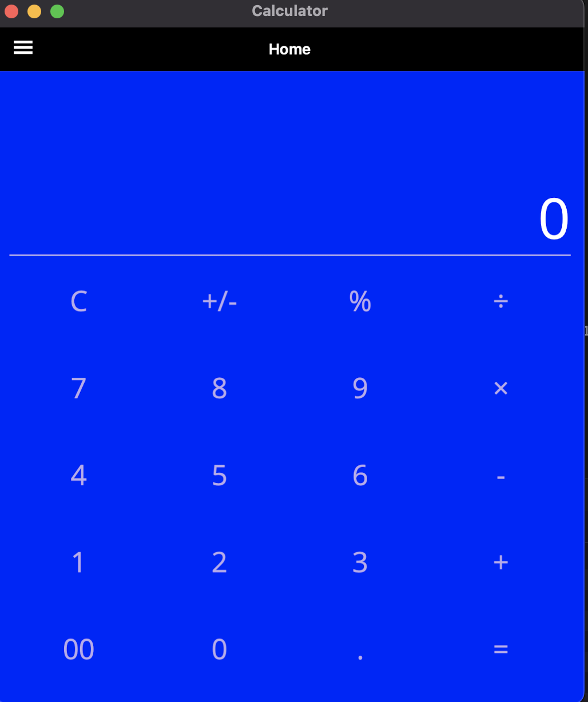
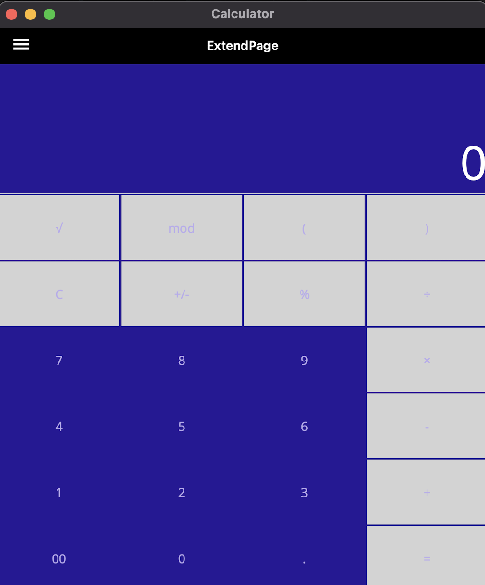
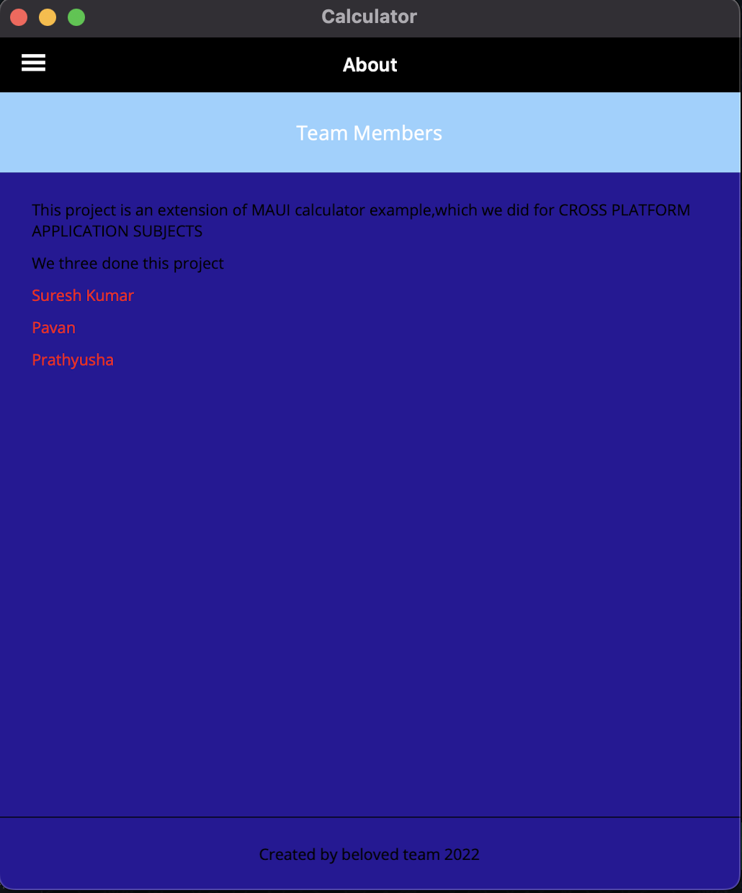
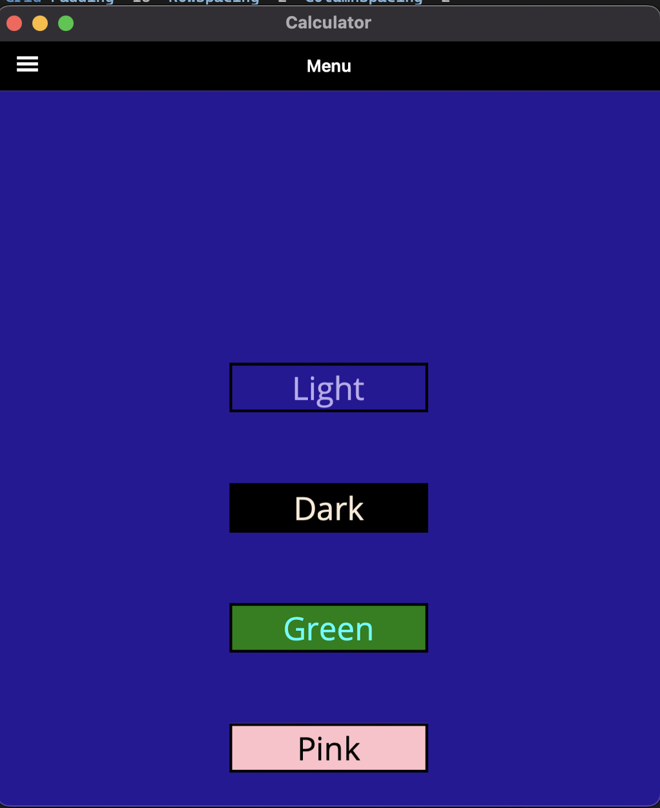
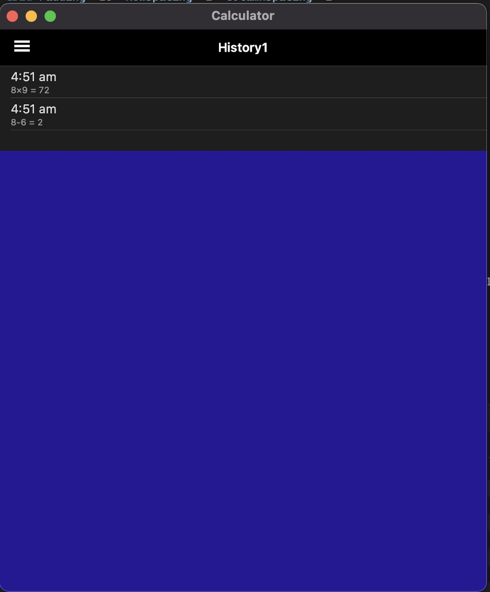

# Calculator Sample App

# Calculator
----
### Team Members: 
suresh
kilaruPrathyusha
patibandla pavan

----
### Teammate's Contribution:  

#### suresh
 
  
    ##### Assignment3:
  1. Flyout page
  2. History Backend Logic( cs files)
  3. About UI changes
  4. Documentation
  
#### kilaruPrathyusha
 

  ##### Assignment3:
1. History Frontend Logic
2. Logic for questions were improved
3. UI Changes calender UI and backend research work for history page

#### patibandla pavan

   ##### Assignment3:
  1. API Implementation and added more data to it.
  2. History Frontend Logic
  3. UI changes in colors and style in resources

----
### Images:  
 
 

  #### Assignment2: 

